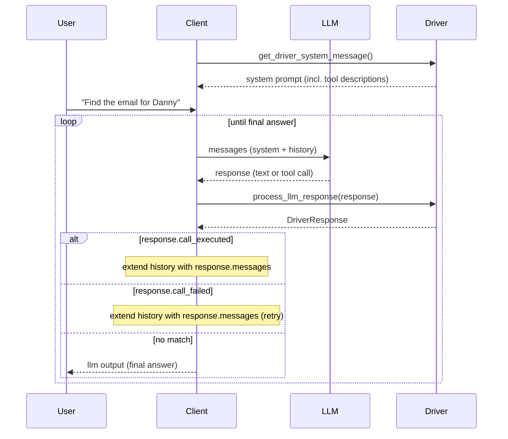

# Model Context Standard (MCS)

**Unlock the Power of LLMs: A lightweight standard for connecting LLMs to external systems through reusable drivers, not wrappers or bloated protocols**

Connecting LLMs to external systems is still harder than it should be. Most current solutions rely on custom wrappers or complex function-calling protocols that require heavy infrastructure and manual parsing. MCS offers a simpler alternative.

MCS treats integration as a driver problem. Just like operating systems use device drivers, LLMs can use interface drivers to connect to APIs, tools, databases or devices. Instead of writing custom glue code, you configure reusable drivers based on existing standards like OpenAPI and REST. These drivers translate between your LLM’s language output and actionable operations.

If you've used MCP before, MCS builds on the same core -- the function calling principle -- but avoids MCP's downsides, like a new stack, new security headaches and complex hosting. It's faster to adopt, easier to maintain, and model-agnostic.

MCS is your plug-and-play standard for safe, scalable and elegant LLM integration.


## Key Benefits: Why Choose MCS?

MCS is a lightweight standard focused on what's essential for **connecting LLMs to real systems**.  It is **function calling** at its core.
Instead of building custom wrappers or servers, you configure reusable drivers that use existing specs like OpenAPI.  
Mix and match, extend or trim functions by URL, no redeploys, no prompt engineering headaches, and no code changes.

### ✅ Universal Driver Architecture
Write a driver once, and everyone can use it everywhere. Whether it's REST-HTTP, EDI-AS2, Filesystem-localfs or even CAN-Bus or MCP-STDIO. **All** LLM apps can plug into it. 
No more wrappers, no more reimplementation or endless prompt engineering. Just configure and connect.

### ✅ Utilizes Proven Protocols
MCS avoids custom stacks and leverages OpenAPI, REST, OAuth and similar proven standards. This ensures better compatibility, security, and maintainability. 
Easier auditing and integration into existing toolchains.

### ✅ No More Glue Code
If your API already exists, why wrap it again? MCS connects directly to the specs. 
Skip the wrapper server. Zero proxy layers. Just point to the spec and you're ready.

### ✅ Optimized Prompts, Built-In
Drivers include refined prompts tested across models. 
No manual prompt tuning on the client side needed. MCS handles model-specific quirks automatically.
It's future-proof too with potential dynamic hubs using checksums to auto-load updated, high-performance versions for new models. 

### ✅ Autostart? Not Required
Unlike MCP's autostart dependency, MCS avoids that. Drivers connect directly to existing systems, avoiding unnecessary CPU usage and security risks.
Use autostart only when needed and do it safely. MCS makes suggestions how to implement this more safely.

### ✅ Compatible with MCP, but Cleaner
MCP pioneered standardization in this area, MCS makes it practical.
MCS drivers can wrap existing MCP endpoints (e.g. mcs-driver-mcp-stdio) to enable smooth migration.
You get modularity, reuse and zero lock-in.

### ✅ Scales from Simple to Complex
From Web APIs to industrial IoT, MCS abstracts the complexity. 
Drivers handle the complexity, your app stays focused.


## Quickstart: The Idea in Under 2 Minutes

You don’t need a complex setup to inject context into an LLM. No protocol, no wrapper server, no SDK. A well-described API and a model that can read it – that’s all it takes.

This demo proves exactly that. It uses **no MCS driver at all**. Instead, it shows the raw principle that MCS is built on: if an LLM can read a function description and call the endpoint, the integration is already done.

We provide a tiny FastAPI service that exposes a **readable OpenAPI HTML spec** and a test function (`fibonacci`) that returns `2 × Fibonacci(n)`, helping detect hallucinations.

> ℹ️ Most LLMs can currently access external content only via `GET` requests and basic HTML parsing. But that’s enough to demonstrate the concept.


### Deploy the Demo (VPS, Docker, Cloud)
```bash
# clone on a VPS / cloud VM with a public DNS or IP
$ git clone https://github.com/modelcontextstandard/modelcontextstandard.git
$ cd modelcontextstandard
$ docker compose -f docker/quickstart/docker-compose.yml up -d  # exposes :8000 on your public host
# optional: use a tunnel such as ngrok or cloudflared if you do not have a static IP
```

> 🛠️ Tip: Platforms like **Coolify** or **Render** make one‑click deployment of Dockerised apps very easy.

Don’t have a server? Use the hosted demo (up while supplies last):

```
https://mcs-quickstart-html.coolify.alsdienst.de
```

### How It Works
The service exposes two endpoints:

| Path                  | Purpose                                            |
| --------------------- | -------------------------------------------------- |
| `/openapi-html`       | HTML-rendered OpenAPI spec (easy for LLMs web access to parse)     |
| `/tools/fibonacci?n=` | returns *2 × Fibonacci(n)* to detect hallucination |


### Try It Yourself
1. Ensure the demo is reachable via public URL. (or use the hosted URL above).
2. Ask your LLM to open /openapi-html, understand the interface.
3. Ask the LLM to get you the fibonacci result for some value (e.g. 8).
4. (if needed) In a second prompt, ask the LLM to build and visit the resulting URL (e.g. `...?n=8`).
5. A correct result is 42. If the LLM says 21, it hallucinated.


### Test Results with Web-Enabled LLMs

Click on the links to see the results in the chats with the LLMs.

| Model             | Result | Notes                  |
| ----------------- | ------ | ---------------------- |
| ChatGPT (Browser) | ✅      | [requires two prompts](https://chatgpt.com/c/68582012-7c70-8009-8c39-b5d05613ecd8)   |
| Claude 3 (web)    | ✅      | [two‑step flow](https://claude.ai/share/57128a2d-22f8-440f-a09d-41018459d94f), restricted so it could not be done in one call          |
| Gemini            | ❌      | refuses second request |
| Grok 4            | ⚠️ Partial      | [Seems to work](https://grok.com/share/bGVnYWN5_f8e10a15-65a9-47de-b43e-c72d9c004af9), but result is not readable by Groks browser (Minimal HTML Output)     |
| DeepSeek          | ❌      | hallucination, server call never happened         |


### What This Shows
Even without any MCS driver in place, modern LLMs can already interact with well-described APIs. No wrapper, no protocol – just a spec and an endpoint.

This is exactly the simplicity that MCS formalizes. A driver packages the spec, the prompt, and the execution logic into a reusable component. What you just did manually (read the spec, call the endpoint), the driver does automatically – for every LLM, every time.

**Next step:** Run a real MCS driver with a local LLM client in Docker – see the [Python SDK](https://github.com/modelcontextstandard/python-sdk) for examples.


## How It Works: The Conversation Loop

In a real application the client, the LLM and one or more drivers interact in a loop. The driver is **stateless** -- all outcome information is returned inside a `DriverResponse` object:



The driver never talks to the LLM directly. It only provides the spec and executes calls. Because the driver holds no mutable state, it is thread-safe by design. New transports and protocols only need a driver, not changes to the client or the LLM integration.


## Why MCS exists: The Problem with Current Solutions
LLMs are becoming the core of modern software stacks, but connecting them to external systems remains unnecessarily complex. MCP deserves credit for being the first serious attempt to standardize function calling. It sparked the revolution and gave developers a protocol to build upon.

However, MCP introduces fundamental challenges that make it harder to adopt than necessary.


### The Protocol Overhead Problem
MCP creates a new protocol stack on top of JSON-RPC, essentially reimplementing what HTTP has solved for decades. This means:

- Reinventing proven solutions: Authentication, request handling, error management – all rebuilt from scratch
- New security vulnerabilities: Recent discoveries show the risks of custom protocol implementations  [2](https://thehackernews.com/2025/07/critical-vulnerability-in-anthropics.html), [3](https://www.oligo.security/blog/critical-rce-vulnerability-in-anthropic-mcp-inspector-cve-2025-49596), [4](https://thejournal.com/articles/2025/07/08/report-finds-agentic-ai-protocol-vulnerable-to-cyber-attacks.aspx), [5](https://noailabs.medium.com/mcp-security-issues-emerging-threats-in-2025-7460a8164030), [6](https://www.redhat.com/en/blog/model-context-protocol-mcp-understanding-security-risks-and-controls) et al.
- Additional complexity: Developers must learn new patterns instead of leveraging existing HTTP knowledge
- New Tooling: You can not simply reuse what you build with MCP

**The irony:** What you can accomplish with MCP, you can already do with REST over HTTP using battle-tested security, established tooling, and decades of optimization.

### The Wrapper Server Multiplication
MCP's architecture forces you to create wrapper servers for every integration:

`Your API → MCP Wrapper Server → MCP Client → LLM`

This creates several problems:

- Double infrastructure: Every API needs its own wrapper server running alongside the original server
- Maintenance overhead: Each wrapper must be updated, monitored, and secured independently
- Resource waste: Unnecessary processes consuming CPU and memory
- Security multiplication: More servers mean more attack surfaces

This is not just our assessment. Prominent voices in the developer community have reached the same conclusion:

- *"Stop Converting Your REST APIs to MCP"* [7](https://www.jlowin.dev/blog/stop-converting-rest-apis-to-mcp) argues that auto-wrapping REST APIs poisons AI agents with human-oriented granularity, polluting context and compounding tool-choice errors.
- *"Stop Generating MCP Servers from REST APIs!"* [8](https://www.kylestratis.com/posts/stop-generating-mcp-servers-from-rest-apis/) shows that five chained REST calls with 95% individual accuracy drop overall success to ~77%, costing roughly 7x more tokens than a single purpose-built tool.

### The Autostart Security Risk
MCP's STDIO-based autostart spawns processes with user privileges, creating potential security vulnerabilities:

- Untrusted code execution: Malicious MCP servers can run with full user access
- Process bloat: Background processes running even when not needed
- Privilege escalation risks: One compromised server can affect the entire system

Research suggests up to 8% of MCP servers on GitHub contain potentially malicious code [1](https://blog.virustotal.com/2025/06/what-17845-github-repos-taught-us-about.html). Enterprise security experts echo these concerns: an analysis found 88% of MCP servers require credentials, with 53% relying on static, long-lived secrets. The conclusion: *"stdio-based MCP servers break nearly every enterprise security pattern"* [9](https://blog.christianposta.com/mcp-should-be-remote/).

### The Development Burden
For every MCP client developer:

- Master prompt engineering for each model
- Handle protocol-specific authentication with a new protocol
- Learn new toolchains for debugging, monitoring and auditing
- Implement MCP client logic for each application

For every MCP server developer:

- Write a new wrapper server for each API they want to make available to LLMs
- If they create an MCP server with valuable logic, they cannot reuse it in classic applications without also reimplementing the MCP client
- Maintain separate codebases for MCP and non-MCP integrations

This creates a fragmented ecosystem where useful logic gets locked into MCP-specific implementations.


### MCS is a pragmatic evolution
MCS addresses these pain points by recognizing that this is fundamentally a driver problem, not a protocol problem.

MCS trims function calling down to two building blocks:

- **Spec:** Machine-readable function descriptions -- use standards if possible! OpenAPI, JSON Schema, GraphQL SDL, WSDL, gRPC/Protobuf, OpenRPC, EDIFACT/X12, or custom formats.
- **Bridge:** Transport layers (HTTP, AS2, CAN, ...) -- handled by parsers.

Just like operating systems use device drivers to communicate with hardware, LLMs need interface drivers to communicate with external systems. 
The key difference with MCS:

**An MCS driver doesn't handle a specific function or API**, it handles **all APIs using the same protocol over the same transport**.
This makes it behave like a true driver for the protocol and transport, abstracting these details for the LLM and client developer.


#### Universal Protocol Support
- Write once, use everywhere: A REST-HTTP driver works across all LLM applications
- Leverage existing standards: OpenAPI, OAuth, HTTP – proven and secure
- No wrapper servers needed: Connect directly to existing APIs
- Built-in optimizations: Prompts are tested and optimized within the driver

#### Direct API Integration
Instead of:

`Your API → MCP Wrapper → MCP Client → LLM`

MCS enables:

`Your API (with standard spec) → MCS Driver → LLM`

**The crucial difference:** The MCS driver can handle any REST API, not just one specific API. Point it to different OpenAPI specs, and it works universally without modification.

#### Security by Design

- No custom protocols: Leverage HTTP's proven security model
- Optional autostart: Only when needed, containerized and sandboxed
- Reduced attack surface: Fewer components, established security practices
- Standard authentication: OAuth, API keys, JWT – use what already works

MCS drivers are static components like software modules that can be downloaded and used directly. This enables trusted driver repositories with checksum verification, similar to APT or Maven. Making secure deployment and auto-loading straightforward.


#### Developer Experience
With MCS, developers get:

- Plug-and-play integration: Configure drivers instead of writing wrappers
- No prompt engineering: Optimized prompts are built into drivers
- Standard tooling: Use existing HTTP debugging and monitoring tools
- Modular architecture: Mix and match drivers as needed


#### Migration Path
Already using MCP? MCS provides a smooth transition:

- Wrap existing MCP servers as MCS drivers (mcs-driver-mcp-stdio)
- Gradual migration without breaking existing functionality
- Immediate benefits for new integrations


#### The Bottom Line

MCP pioneered the concept, but MCS makes it practical. While MCP requires rebuilding HTTP functionality and managing wrapper servers, MCS leverages existing standards and eliminates unnecessary complexity.

| Aspect | MCP | MCS |
|--------|-----|-----|
| **Protocol** | Custom JSON-RPC stack | Standards like HTTP/OpenAPI |
| **Server Architecture** | Wrapper server per API | Direct API connection |
| **Autostart** | Required via STDIO | Optional, containerized |
| **Authentication** | Custom implementation | Standard OAuth/JWT/API keys |
| **Distribution** | Complex server deployment | Simple module download (APT/Maven-like) |
| **Prompt Engineering** | App developer responsibility | Built into drivers |
| **Reusability** | API-specific servers | Universal protocol drivers |
| **Security Model** | New attack surfaces | Proven HTTP security |
| **Tooling** | Custom debugging/monitoring | Standard tools can be used |
| **Integration Effort** | High (wrapper + client code) | Low (configure driver) |


#### What This Means
**For developers**, MCS delivers less code to write and maintain, faster integration with existing APIs, better security through proven protocols, and the freedom to focus on business logic instead of protocol details.

**For organizations**, this translates to lower infrastructure costs, reduced security risks, faster time to market, and better resource utilization across development teams.

MCS doesn't replace MCP, it evolves the concept by removing the barriers that make integration difficult. The result is a standard that's easier to adopt, safer to deploy, and simpler to maintain.


## Contributing: Building the Ecosystem Together
MCS thrives as an open standard, and we're building a collaborative ecosystem where your expertise makes a real difference.

### Key Areas Where Support is Needed

- Specification refinement is crucial for MCS's success. We need contributors to identify edge cases, develop model-specific optimizations, and help us reduce complexity to the absolute essentials. Every improvement benefits the entire ecosystem.
- Driver development opens up new possibilities. Whether you're interested in creating drivers for GraphQL, MQTT, industrial protocols like CAN-Bus, or even specialized hardware like printers, your work enables countless applications. Our Python SDK provides a solid foundation to get started.
- SDK expansion makes MCS accessible to more developers. We're particularly focused on fleshing out TypeScript support, with plans to generate interfaces from our Python implementation. If you're skilled in other languages, we'd welcome additional SDK contributions.
- Documentation and tutorials help newcomers understand MCS's potential. We're looking for contributors to create practical guides, such as "Building a Custom Driver" tutorials that demonstrate the complete workflow from initialization to automated prompt handling.
- Registry infrastructure will make driver discovery and sharing seamless. Help us launch mcs-pkg, a trusted repository system with checksum verification, similar to how APT or Maven handle package distribution.
- Real-world examples and security best practices documentation ensure MCS deployments are both effective and secure. Share your integration experiences and help establish community standards.

### Getting Started
Visit our GitHub organization to explore the codebase and see current priorities. Check CONTRIBUTING.md for detailed guidelines on code standards, testing requirements, and submission processes.

Whether you're contributing code, documentation, or ideas, you're helping build the future of LLM integration. Every contribution, no matter how small, moves us closer to a world where connecting LLMs to external systems is as simple as plugging in a driver.