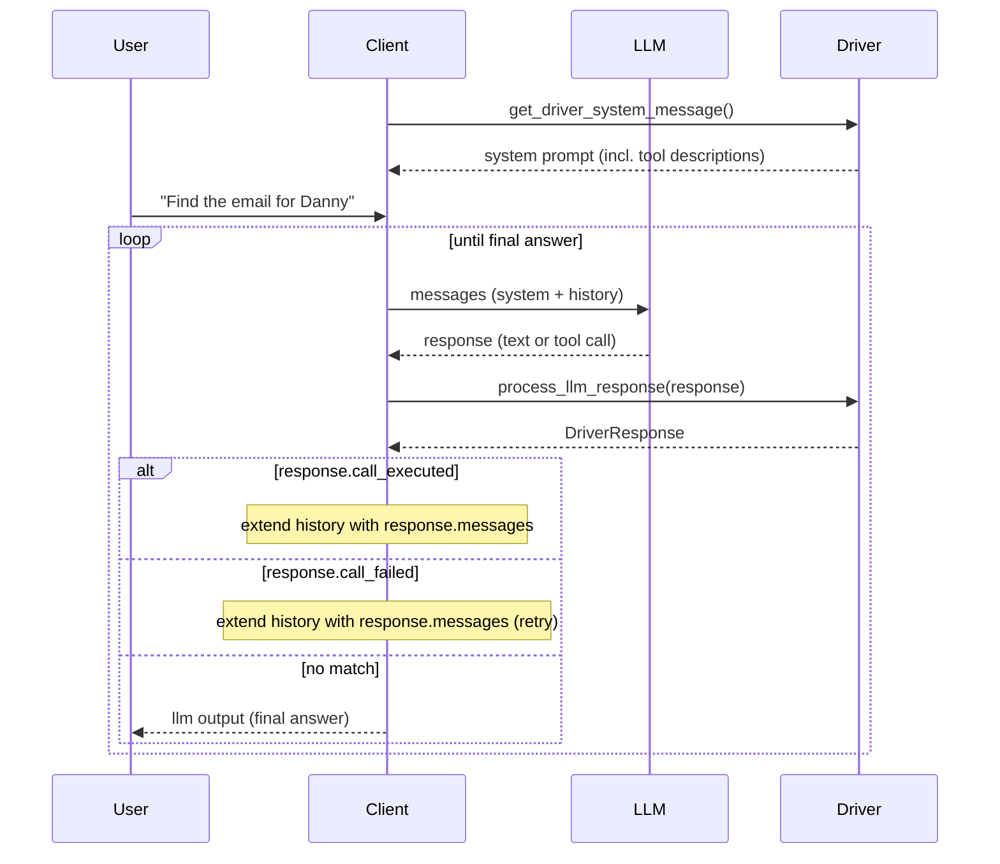

# Model Context Standard (MCS)

**Your LLM needs to call an API. Today that means writing a wrapper server, a custom protocol, and prompt engineering from scratch. MCS gives you a driver instead -- configure once, connect any LLM to any API.**

## The Problem You Know Too Well

You have a REST API. Your LLM should use it. So you start building:

- A wrapper server that translates between your API and the LLM
- Custom authentication logic for a protocol your team has never debugged before
- Hand-tuned prompts that break when you switch models
- A deployment pipeline for yet another service that needs monitoring

Three days later, you have one integration. You need twelve.

Meanwhile, [up to 8% of MCP servers on GitHub contain potentially malicious code](https://blog.virustotal.com/2025/06/what-17845-github-repos-taught-us-about.html). Enterprise security analysts found that 88% of MCP servers require credentials, with 53% relying on static, long-lived secrets. Their conclusion: *"stdio-based MCP servers break nearly every enterprise security pattern"* [(source)](https://blog.christianposta.com/mcp-should-be-remote/).

**There has to be a better way.** And there is.


## What MCS Does Differently

Andrej Karpathy famously said that LLMs are becoming the new operating systems. If that's true, they need **drivers** -- not wrapper servers.

MCS treats LLM integration as exactly that: a driver problem. Just like your OS uses a printer driver to talk to any printer, an MCS driver lets any LLM talk to any API using the same protocol.

```
Today:    Your API → MCP Wrapper Server → MCP Client → LLM
With MCS: Your API (with OpenAPI spec) → MCS Driver → LLM
```

**The crucial difference:** One REST-HTTP driver handles *every* REST API. Point it to a different OpenAPI spec, and it just works. No new wrapper, no new server, no new code.


## What You Get

### Write once, connect everything
A single driver works across all LLM applications -- ChatGPT, Claude, Llama, your custom agent. Write a REST-HTTP driver once, and every developer on every LLM platform can use it. No more reimplementing the same integration for each model.

### Your API credentials stay invisible to the agent
The driver acts as a trust boundary. Credentials live in the driver constructor -- configured by the operator, invisible to the agent. The agent calls `execute_tool()` and gets results, never secrets. No shell access to credential files, no environment variable leaks.

This is the tool execution layer that agent frameworks are missing today. An LLM that needs to read emails should see `mail.list`, `mail.read`, `mail.send` -- not your IMAP password.

### No wrapper servers, no glue code
If your API already has an OpenAPI spec, you're done. MCS connects directly to the spec. Zero proxy layers, zero additional servers to deploy and monitor.

### Prompts that work out of the box
Stop tuning prompts for every model. Drivers ship with refined prompts tested across models, including healing rules for common LLM output quirks. Swap in updated prompt strategies without changing a single line of code -- they're loaded from external config files, not hardcoded.

### Proven security, not reinvented security
MCS builds on HTTP, OAuth, JWT, and API keys -- standards your security team already knows and audits. No custom protocol means no new attack surface. Drivers are static modules with checksum verification, distributed like APT or Maven packages.

### Compatible with MCP -- but without the overhead
MCP pioneered standardization, and MCS builds on the same core idea: function calling. But MCS avoids the custom protocol stack, the wrapper servers, and the STDIO security risks. Already using MCP? Wrap your existing servers with `mcs-driver-mcp` and migrate gradually.


## See It Working: The Raw Principle in 2 Minutes

Before showing the full driver architecture, here's the raw idea that MCS is built on. No SDK, no driver -- just an LLM reading an API spec and calling the endpoint.

We provide a tiny FastAPI service with a **readable OpenAPI HTML spec** and a test function (`fibonacci`) that returns `2 × Fibonacci(n)` to detect hallucinations.

> Most LLMs can currently access external content only via `GET` requests and basic HTML parsing. That's enough to prove the concept.

**Try it now** -- use the hosted demo or deploy your own:

```
https://mcs-quickstart-html.coolify.alsdienst.de
```

```bash
# or self-host:
git clone https://github.com/modelcontextstandard/python-sdk.git
cd python-sdk
docker compose -f docker/quickstart/docker-compose.yml up -d
```

**Steps:**
1. Ask your LLM to open `/openapi-html` and understand the interface
2. Ask it to get the fibonacci result for n=8
3. Correct result: **42** (the endpoint returns 2 x Fibonacci(n) -- if the LLM says 21, it hallucinated)

### Verified Results

| Model             | Result | Notes                  |
| ----------------- | ------ | ---------------------- |
| ChatGPT (Browser) | ✅      | [requires two prompts](https://chatgpt.com/c/68582012-7c70-8009-8c39-b5d05613ecd8)   |
| Claude 3 (web)    | ✅      | [two-step flow](https://claude.ai/share/57128a2d-22f8-440f-a09d-41018459d94f), restricted so it could not be done in one call          |
| Gemini            | ❌      | refuses second request |
| Grok 4            | ⚠️      | [seems to work](https://grok.com/share/bGVnYWN5_f8e10a15-65a9-47de-b43e-c72d9c004af9), but result is not readable by Grok's browser     |
| DeepSeek          | ❌      | hallucination, server call never happened         |

What you just did manually -- read the spec, call the endpoint -- is exactly what an MCS driver automates. For every LLM, every time, with optimized prompts and built-in error handling.


## How the Driver Loop Works

In a real application the client, the LLM and one or more drivers interact in a loop. The driver is **stateless** -- all outcome information is returned inside a `DriverResponse` object:



The driver never talks to the LLM directly. It provides the spec and executes calls. Because it holds no mutable state, it is thread-safe by design. New transports and protocols only need a new driver -- no changes to the client or LLM integration. If one MCS driver is supported, the rest work out of the box.

MCS trims function calling down to two building blocks:

- **Spec:** Machine-readable function descriptions -- OpenAPI, JSON Schema, GraphQL SDL, WSDL, gRPC/Protobuf, OpenRPC, EDIFACT/X12, or custom formats.
- **Bridge:** Transport layers (HTTP, AS2, CAN, ...) -- handled by adapters.

**An MCS driver doesn't handle a specific API.** It handles **all APIs using the same protocol over the same transport**. That's what makes it a true driver.


## The Full Case: Why Not Just Use MCP?

MCP deserves credit for being the first serious attempt to standardize function calling. It sparked the revolution and gave developers a protocol to build upon. However, MCP introduces fundamental challenges that make it harder to adopt than necessary.

### Protocol overhead
MCP creates a new protocol stack on top of JSON-RPC, reimplementing what HTTP has solved for decades: authentication, request handling, error management -- all rebuilt from scratch. New security vulnerabilities keep appearing [(1)](https://thehackernews.com/2025/07/critical-vulnerability-in-anthropics.html) [(2)](https://www.oligo.security/blog/critical-rce-vulnerability-in-anthropic-mcp-inspector-cve-2025-49596) [(3)](https://thejournal.com/articles/2025/07/08/report-finds-agentic-ai-protocol-vulnerable-to-cyber-attacks.aspx) [(4)](https://noailabs.medium.com/mcp-security-issues-emerging-threats-in-2025-7460a8164030) [(5)](https://www.redhat.com/en/blog/model-context-protocol-mcp-understanding-security-risks-and-controls). What you can accomplish with MCP, you can already do with REST over HTTP using battle-tested security and decades of optimization.

### Wrapper server multiplication
Every API needs its own MCP wrapper server running alongside the original. Double infrastructure, double maintenance, double attack surface. Independent analyses confirm this:

- *"Stop Converting Your REST APIs to MCP"* [(source)](https://www.jlowin.dev/blog/stop-converting-rest-apis-to-mcp) -- auto-wrapping REST APIs poisons AI agents with human-oriented granularity, polluting context and compounding tool-choice errors.
- *"Stop Generating MCP Servers from REST APIs!"* [(source)](https://www.kylestratis.com/posts/stop-generating-mcp-servers-from-rest-apis/) -- five chained REST calls at 95% individual accuracy drop overall success to ~77%, costing roughly 7x more tokens than a single purpose-built tool.

### Autostart security risk
MCP's STDIO-based autostart spawns processes with user privileges. Untrusted code execution, process bloat, privilege escalation -- up to 8% of MCP servers on GitHub contain potentially malicious code [(source)](https://blog.virustotal.com/2025/06/what-17845-github-repos-taught-us-about.html).

### Development burden
MCP client developers must master prompt engineering per model, implement custom authentication, learn new toolchains, and build MCP client logic for each application. MCP server developers write a new wrapper for each API, and any valuable logic they build is locked into MCP-specific implementations -- unusable in classic applications without reimplementing the MCP client.


## Head-to-Head

| Aspect | MCP | MCS |
|--------|-----|-----|
| **Protocol** | Custom JSON-RPC stack | Standards like HTTP/OpenAPI |
| **Server Architecture** | Wrapper server per API | Direct API connection |
| **Autostart** | Required via STDIO | Optional, containerized |
| **Authentication** | Custom implementation | Standard OAuth/JWT/API keys |
| **Distribution** | Complex server deployment | Simple module download (APT/Maven-like) |
| **Prompt Engineering** | App developer responsibility | Built into drivers |
| **Reusability** | API-specific servers | Universal protocol drivers |
| **Security Model** | New attack surfaces | Proven HTTP security |
| **Tooling** | Custom debugging/monitoring | Standard tools can be used |
| **Integration Effort** | High (wrapper + client code) | Low (configure driver) |
| **Credential Isolation** | Agent sees server secrets | Driver holds secrets, agent sees only results |


## Get Started

```bash
pip install mcs-driver-rest
```

```python
from mcs.driver.rest import RestDriver

driver = RestDriver("https://petstore3.swagger.io/api/v3/openapi.json")

system_message = driver.get_driver_system_message()
# Pass system_message to your LLM, then:
response = driver.process_llm_response(llm_output)
```

Three lines of code. No wrapper server, no protocol, no prompt engineering.

- [Python SDK & Examples](https://github.com/modelcontextstandard/python-sdk)
- [Full Specification](https://github.com/modelcontextstandard)
- [Building a Custom Driver](https://github.com/modelcontextstandard)


## Where MCS Stands Today

MCS is the standard that makes the benefits described above possible. The specification is complete, the architecture is in place, and the first drivers are being built right now.

What's already working:
- **Specification** -- The full driver contract, adapter pattern, prompt strategy system, and orchestrator architecture are defined and documented.
- **Python SDK** -- A monorepo with core interfaces, a REST-HTTP driver, a filesystem driver, a CSV driver, and orchestrators with pluggable resolution strategies.
- **Prompt Strategy as Codec** -- All prompt elements are loaded from external config files (TOML), hot-swappable without code changes. The framework for model-specific prompt optimization is ready -- it just needs community testing across models.
- **Extraction Strategy layer** -- Drivers auto-detect whether the LLM responds in text, OpenAI function-call format, or custom dict format. New formats are pluggable.

What needs the community:
- **Prompt tuning per model** -- The infrastructure is there to swap and version prompt strategies. What's missing is systematic testing: which phrasing works best for GPT-4, Claude, Llama, Gemini? Every tested configuration becomes a reusable artifact for everyone.
- **More drivers** -- GraphQL, MQTT, CAN-Bus, MCP-STDIO bridge, specialized hardware. One driver enables every LLM app on the planet.
- **TypeScript SDK** -- Next priority, with plans to generate interfaces from the Python implementation.
- **Registry infrastructure** -- Help launch mcs-pkg, a trusted driver repository with checksum verification (think APT/Maven for LLM drivers).
- **Real-world battle testing** -- Share your integration experiences, edge cases, and security findings.

The foundation is solid. Now it's about making every promise on this page a reality -- and that's a community effort.

Visit our [GitHub organization](https://github.com/modelcontextstandard) to explore the codebase. Check CONTRIBUTING.md for guidelines on code standards, testing, and submissions.
