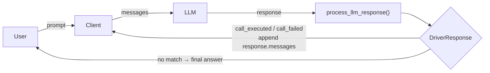

# 2 · Core Idea

**MCS** defines a *thin glue layer* between a Language Model and any existing interface such as REST, GraphQL, CAN-Bus, EDI, or even filesystems.

Every MCS driver must implement **two mandatory capabilities**:

1. **Expose**: Provide a machine-readable function description via `get_function_description()` and a ready-to-use system prompt via `get_driver_system_message()`. The system prompt wraps the function description with model-specific prompt guidance. `get_function_description()` gives the app developer the choice to build their own prompt instead (see [Section 3](3_Minimal%20Driver%20Contract/Minimal_Driver_Contract.md) for why both are required, while only one would be mandatory).
2. **Execute**: Handle structured LLM-emitted calls via `process_llm_response()`, which returns a `DriverResponse` containing the result and execution status. The driver parses the request, routes it through a bridge (HTTP, serial, message bus, etc.), and returns the result.

The complexity of an MCS driver is concentrated in the execution phase. Authentication, rate-limiting, retries, logging, and protocol-specific quirks are all handled internally by the driver, the client never sees them. The driver builds on existing transports and, where available, on machine-readable specifications like OpenAPI to derive tool definitions automatically.

Drivers are initialized with configuration parameters through the constructor. This makes it easy to inject dependencies or load configuration dynamically at runtime.

Optional or advanced functionality can be added modularly via *capabilities*, allowing drivers to remain lightweight by default.

The **client** acts as a coordinator. It retrieves the function specification from the driver, injects it into the LLM system message, and later passes the LLM's output back to the driver for inspection, if an execution of a function is wanted by the LLM.

Importantly, the client does not need to know how the driver works internally, which technology stack it uses or what prompts should be used.

When multiple drivers need to work together, an **Orchestrator** aggregates their tools into a single, unified interface (see [Section 5](5_Orchestrator.md)). Because the Orchestrator itself implements `MCSDriver`, it is transparent to the client -- the same interface, regardless of how many drivers participate behind it. That also allows to stack drivers / orchestrators on top of each other to create a new driver with a different interface.


---

### Phase A – Spec exposure

```
 Client ─── request spec ───▶  Driver
  ▲                              │
  └─── Spec (OpenAPI …) ◄────────┘
```
The client first calls `get_function_description()` to retrieve a machine-readable function specification. How this spec is generated or retrieved—whether from a local file, HTTP endpoint, or generated dynamically, is left to the driver implementation.

The client may embed the spec into the LLM's system prompt or use it in other prompt injection strategies.

To simplify this process, drivers need to implement `get_driver_system_message()` which returns a complete, ready-to-use system prompt. This includes both the tool description and formatting guidance tailored for a LLM or for a specific LLM as well.

This is crucial because different LLMs may respond better to differently phrased prompts.


### Phase B – Call execution

```
LLM ──► JSON call ──► Driver/Parser ──► External API
 ▲                           │
 └─────────── Result ◄───────┘
```

Once the LLM emits a structured function call (typically as a JSON object in the text output), the client passes this to the driver's `process_llm_response()` method.

The driver parses the call, dispatches it over its bridge (e.g. HTTP, CAN-Bus, AS2), and returns the raw result. The result can then be forwarded back into the conversation, either directly or via formatting logic handled elsewhere.


### Phase C – Conversation loop

In practice, a single user request may require multiple tool calls before the LLM can produce a final answer. The client therefore runs an iterative loop:



1. The client sends the conversation (system prompt + message history) to the LLM.
2. The LLM responds. The client passes the response to `process_llm_response()`, which returns a `DriverResponse`.
3. If `response.call_executed` is true: the client appends `response.messages` to the conversation history and returns to step 1. The messages are pre-formatted by the driver and include the original LLM output and the tool result.
4. If `response.call_failed` is true: the driver found a tool-call signature but could not parse or execute it. The client appends `response.messages` (which includes the retry hint) to the conversation and returns to step 1.
5. If neither flag is set: no tool call was detected. `response.messages` is `null` -- the LLM output is the final answer for the user.

The driver is **stateless** -- all outcome information lives in the returned `DriverResponse`. The driver does not track conversation history; that remains the client's responsibility. The `messages` field shifts message formatting from the client to the driver, keeping client logic minimal while allowing arbitrarily complex multi-step interactions.

A Proof of Idea with existing ChatModels can be found [here](https://github.com/modelcontextstandard#quickstart-the-idea-in-under-2-minutes).
